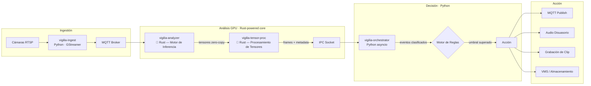

> [!IMPORTANT]
> Este repositorio es una **exhibición de arquitectura** — no contiene código fuente.
> El sistema Vigilia es desarrollado de forma privada por [@Bajmein](https://github.com/Bajmein).
> Lo que encontrarás aquí: documentación técnica del pipeline, plantillas de infraestructura y el diagrama del sistema.

# Vigilia

Sistema de análisis de video en tiempo real con detección de eventos, toma de decisiones autónoma y respuesta configurada. Diseñado para entornos con restricciones de latencia y privacidad.

---

## Pipeline de Datos



---

## Stack Tecnológico — Arquitectura Híbrida Python/Rust

| Capa | Tecnología | Rol |
|------|-----------|-----|
| **Motor de Inferencia** | **Rust** | Inferencia GPU con seguridad de memoria en tiempo de compilación — Memory-safe video processing |
| **Procesamiento de Tensores** | **Rust** | Operaciones zero-copy sobre buffers de frames — bypass del GIL, rendimiento determinista |
| Ingestión | GStreamer + Python | Captura de streams RTSP y decodificación inicial |
| Análisis GPU | CUDA + TensorRT | Pipeline de detección acelerado por hardware |
| Mensajería | Eclipse Mosquitto | Bus MQTT inter-servicio |
| Orquestación | Python (asyncio) | Motor de reglas, configuración y toma de decisiones |
| Infraestructura | Docker Compose | Despliegue multi-servicio con soporte GPU |
| Almacenamiento | Volúmenes Docker | Retención de clips y logs de eventos |
| Acceso remoto | Tailscale + WHEP | Acceso seguro a streams y panel de control |

### Por qué Rust en el núcleo

- **Zero-copy operations**: los tensores de video (~6 MB/frame) viajan de cámara a GPU sin una sola copia en memoria — los módulos Rust trabajan directamente sobre buffers compartidos.
- **Bypass del GIL de Python**: el Motor de Inferencia y el Procesador de Tensores corren en threads nativos de OS, sin el Global Interpreter Lock. Paralelismo real.
- **Rendimiento determinista**: sin garbage collector. La latencia de ingestión a decisión es predecible bajo carga sostenida — crítico para respuesta a eventos de seguridad.

---

## Inicio Rápido (Infraestructura)

> Requiere Docker Engine con soporte NVIDIA Container Toolkit.

```bash
# Copiar plantillas de configuración
cp docker-compose.example.yml docker-compose.yml
cp config.example.yaml config.yaml

# Editar credenciales y parámetros (ver comentarios en cada archivo)
# ...

# Levantar los servicios
docker compose up -d

# Ver logs del analizador
docker compose logs -f vigilia-analyzer
```

---

## Estado

**Versión:** `v0.8.1`

El sistema se encuentra en fase de producción controlada. Las siguientes capacidades están operativas:

- Pipeline de detección en tiempo real con GPU
- Motor de reglas configurable por zona
- Integración con VMS externos
- Acceso remoto via Tailscale

---

## Licencia

El código fuente de Vigilia es **privado** y no se encuentra disponible en este repositorio.

Este repositorio existe exclusivamente como referencia de arquitectura y como muestra de capacidades técnicas.

Para consultas, contactar a [@Bajmein](https://github.com/Bajmein).
