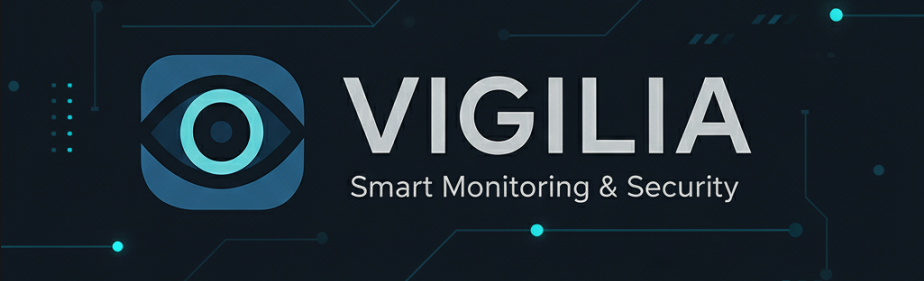
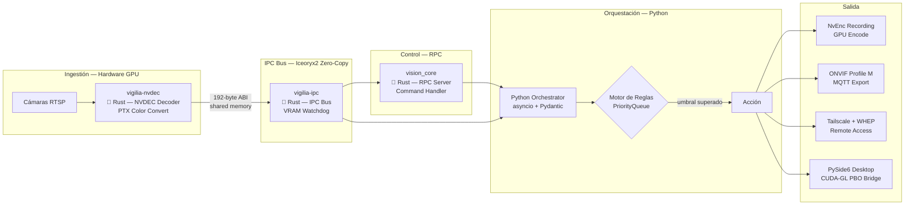

> [!IMPORTANT]
> Este repositorio es una **exhibición de arquitectura** — no contiene código fuente.
> El sistema Vigilia es desarrollado de forma privada por [@Bajmein](https://github.com/Bajmein).
> Lo que encontrarás aquí: documentación técnica del pipeline, plantillas de infraestructura y el diagrama del sistema.

# Vigilia Reforged




> [!IMPORTANT]
> Este repositorio es una **exhibición de arquitectura** — no contiene código fuente.
> Lo que encontrarás aquí: documentación técnica del pipeline, plantillas de infraestructura y el diagrama del sistema.

Sistema de análisis de video en tiempo real con detección de eventos y toma de decisiones, diseñado para entornos que requieren baja latencia y alta privacidad.

---

## Acerca del Proyecto

Vigilia Reforged es un proyecto experimental para el análisis de video autónomo. El objetivo es crear un sistema capaz de detectar eventos relevantes y reaccionar ante ellos de forma eficiente, ejecutándose en local para garantizar la privacidad de los datos.

Este documento detalla la estructura técnica del pipeline y la forma en que los distintos componentes colaboran para lograr una respuesta rápida y confiable.

---

## Pipeline de Datos



---

## Stack Tecnológico — Arquitectura Híbrida Python/Rust

| Capa | Tecnología | Rol |
|---|---|---|
| **Decodificación** | **Rust + NVDEC** | Hardware video decode en GPU |
| **IPC Bus** | **Rust + Iceoryx2** | Transporte eficiente de frames entre módulos |
| **VRAM Lifecycle** | **Rust + CUDA** | Gestión de memoria en GPU |
| **RPC Control** | **Rust + Iceoryx2** | Comunicación entre componentes |
| Grabación GPU | Python + NvEnc/CUDA | Hardware encode asíncrono |
| Orquestación | Python asyncio + Pydantic | Motor de reglas, preemption de alarmas |
| Integración VMS | ONVIF Profile M + MQTT | Export de metadata |
| Acceso remoto | Tailscale + WebRTC/WHEP | Streaming seguro P2P |
| Desktop viewer | PySide6 + CUDA-GL | Visualización |

### Tecnologías Clave

Este proyecto utiliza una combinación de Python y Rust:
- **Rust** para el procesamiento de alta intensidad y la comunicación eficiente entre componentes.
- **Python** para la orquestación, gestión de reglas y tareas de más alto nivel, facilitando la configuración y el mantenimiento.

La arquitectura busca separar la potencia de procesamiento de la lógica de negocio, logrando un sistema balanceado.

---

## Inicio Rápido (Infraestructura)

> Requiere Docker Engine con soporte NVIDIA Container Toolkit.

```bash
# Copiar plantillas de configuración
cp docker-compose.example.yml docker-compose.yml
cp config.example.yaml config.yaml

# Levantar los servicios
docker compose up -d

# Ver logs del analizador
docker compose logs -f vigilia-analyzer
```

---

## Estado

**Versión:** `v0.13.0`

El sistema se encuentra en fase de pruebas operativas. Las siguientes capacidades están integradas:

- Pipeline de detección en tiempo real
- Motor de reglas configurable
- Integración con VMS externos
- Acceso remoto via Tailscale

---

## Soporte y Contacto

- Alertas del sistema: alertas@vigilia-security.tech
- Contacto técnico: [kenno@vigilia-security.tech](mailto:kenno@vigilia-security.tech)

## Licencia

El código fuente de Vigilia es **privado** y no se encuentra disponible en este repositorio.

Este repositorio existe exclusivamente como referencia de arquitectura y como muestra de capacidades técnicas.

Para consultas, contactar a [@Bajmein](https://github.com/Bajmein).
