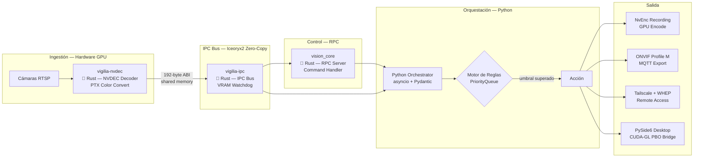

> [!IMPORTANT]
> Este repositorio es una **exhibición de arquitectura** — no contiene código fuente.
> El sistema Vigilia es desarrollado de forma privada por [@Bajmein](https://github.com/Bajmein).
> Lo que encontrarás aquí: documentación técnica del pipeline, plantillas de infraestructura y el diagrama del sistema.

# Vigilia Reforged

Sistema de análisis de video en tiempo real con detección de eventos, toma de decisiones autónoma y respuesta configurada. Diseñado para entornos con restricciones de latencia y privacidad.

---

## Pipeline de Datos



---

## Stack Tecnológico — Arquitectura Híbrida Python/Rust

| Capa | Tecnología | Rol |
|---|---|---|
| **Decodificación** | **Rust + NVDEC** | Hardware video decode en GPU + PTX color conversion (NV12→RGB_F32, BT.601) |
| **IPC Bus** | **Rust + Iceoryx2** | Zero-copy shared memory IPC — 192-byte `GpuBufferDescriptor` ABI, lock-free queues |
| **VRAM Lifecycle** | **Rust + CUDA** | Watchdog de buffers GPU — gestión determinista sin GC |
| **RPC Control** | **Rust + Iceoryx2** | Reactive RPC server para comandos al pipeline |
| Grabación GPU | Python + NvEnc/CUDA | Hardware encode asíncrono con CUDA event sync |
| Orquestación | Python asyncio + Pydantic | Motor de reglas, PriorityQueue para preemption de alarmas |
| Integración VMS | ONVIF Profile M + MQTT | Export de metadata analítica hacia sistemas externos |
| Acceso remoto | Tailscale + WebRTC/WHEP | Streaming seguro P2P sin exposición de puertos |
| Desktop viewer | PySide6 + CUDA-GL | Visualización con bridge CUDA→OpenGL PBO, latency tracking |

### Por qué Rust en el núcleo

- **Zero-copy operations**: los tensores de video (~6 MB/frame) viajan de cámara a GPU sin una sola copia en memoria — los módulos Rust trabajan directamente sobre buffers compartidos.
- **Bypass del GIL de Python**: el Motor de Inferencia y el Procesador de Tensores corren en threads nativos de OS, sin el Global Interpreter Lock. Paralelismo real.
- **Rendimiento determinista**: sin garbage collector. La latencia de ingestión a decisión es predecible bajo carga sostenida — crítico para respuesta a eventos de seguridad.

- **Iceoryx2 como IPC**: Los tres crates Rust comparten memoria directamente vía Iceoryx2 — un sistema IPC lock-free basado en shared memory. Elimina la serialización, el round-trip al broker y la copia de datos entre procesos. Los frames de video (~6 MB) se transfieren con un descriptor de 192 bytes.
- **NVDEC pipeline end-to-end en GPU**: El frame entra al pipeline desde la cámara y no toca RAM del sistema hasta que el orquestador Python lo necesita. NVDEC decodifica en VRAM; PTX kernels convierten el espacio de color en-device; Iceoryx2 transfiere el descriptor (no el frame) al siguiente stage.
- **VRAM watchdog pattern**: La gestión de buffers GPU consulta el estado del hardware antes de liberar memoria — garantía de seguridad sin mutexes ni reference counting en hot paths.

---

## Inicio Rápido (Infraestructura)

> Requiere Docker Engine con soporte NVIDIA Container Toolkit.

```bash
# Copiar plantillas de configuración
cp docker-compose.example.yml docker-compose.yml
cp config.example.yaml config.yaml

# Editar credenciales y parámetros (ver comentarios en cada archivo)
# ...

# Levantar los servicios
docker compose up -d

# Ver logs del analizador
docker compose logs -f vigilia-analyzer
```

---

## Estado

**Versión:** `v0.8.1`

El sistema se encuentra en fase de producción controlada. Las siguientes capacidades están operativas:

- Pipeline de detección en tiempo real con GPU
- Motor de reglas configurable por zona
- Integración con VMS externos
- Acceso remoto via Tailscale

---

## Soporte y Contacto

- Alertas del sistema: alertas@vigilia-security.tech
- Contacto técnico: [kenno@vigilia-security.tech](mailto:kenno@vigilia-security.tech)

## Licencia

El código fuente de Vigilia es **privado** y no se encuentra disponible en este repositorio.

Este repositorio existe exclusivamente como referencia de arquitectura y como muestra de capacidades técnicas.

Para consultas, contactar a [@Bajmein](https://github.com/Bajmein).
